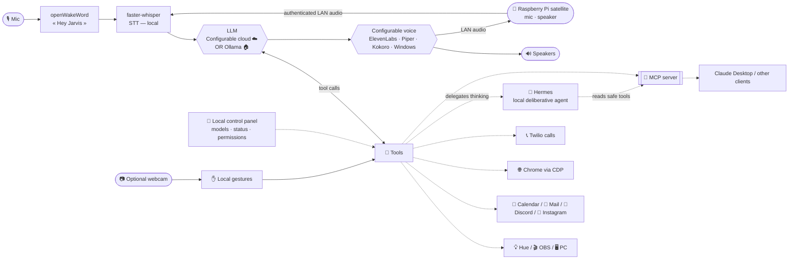

# 🤖 Jarvis — local-first voice assistant

*[Version française](README.md)*


A French-speaking voice assistant that runs **on your own machine**. Say *"Hey Jarvis"*,
speak naturally, and it reasons with an LLM, uses a growing toolbox (smart home, PC,
web, phone…), and answers out loud. Choose between three distinct modes:
**hybrid** (everyday cloud AI + Hermes for background work), **quality** (the most
capable configured cloud model), or **fully offline local** (Ollama + local voice).
LLM and voice are independent choices. **OpenAI and Claude/Anthropic are integrated
today**; other providers such as Gemini can be added through a connector without
changing these three modes.

**🧠 Jarvis + Hermes.** Jarvis delegates long-form research and planning to the
local [Hermes](docs/hermes.md) agent. The boundary is explicit: **Hermes orchestrates
and thinks; Jarvis holds the keys and the body**. Jarvis alone performs actions, and
credentials never enter the Hermes environment.

**📡 Jarvis in every room.** Add one or more **Raspberry Pi satellites** to move
the microphone and speaker into a kitchen, living room, or any other room. The PC
remains the central brain; each satellite detects *"Hey Jarvis"* locally and talks
to it over the local network/Wi-Fi, **with no long cable back to the PC**
([how it works](docs/satellite.md) · [setup guide](docs/satellite_pi.md)).

> Personal project shared as-is. Targets **Windows 11**, needs a microphone and (for
> cloud mode) an API key from the selected provider. Consumer subscriptions and APIs
> are generally separate. Most integrations are **optional** and disable
> themselves cleanly when unconfigured.

## ✨ Features

- 🎙️ **Voice-first** — wake word (openWakeWord), local transcription (Whisper), spoken replies
- 👁️ **Screen vision** — "what's this error?", "read this", "translate that" (screenshot → LLM)
- 💡 **Smart home** — Philips Hue (on/off, brightness, color), light scenes & moods
- 🎬 **Streaming** — OBS control (stream, record, scenes, replay buffer)
- 🖥️ **PC control** — launch apps, media/volume, live GPU/CPU/RAM stats
- 📅 **Calendar** — Google Calendar across **all** your calendars (incl. subscribed iCal), create/delete with confirmation
- 📧 **Email** — Gmail summaries and drafting
- 💬 **Discord** — mentions + daily channel digest
- 📸 **Instagram** — followers & video views vs. yesterday (multi-account)
- 🍽️ **Web reservations** — books restaurants/appointments via a real browser (Playwright)
- 🌐 **Browser assistant** — summarize/translate the active tab, manage tabs, act on pages (your real Chrome)
- 📞 **Phone calls** — Twilio: play a message, or a real-time conversation (make a reservation by phone)
- 🧠 **Long-term memory** — remembers your preferences, people, projects
- 📱 **iPhone bridge** — send ideas/notes and commands from the Shortcuts app (Siri as a remote control)
- 🎭 **Personalities** — sarcastic butler, neutral, concise — switch by voice
- 🏠 **Presence** — pings your phone, triggers scenes when you leave/return
- 🚀 **Automatic startup & scenes** — starts Jarvis and its local chain at sign-in, runs a first-start daily weather/calendar brief, and prepares a clean shutdown
- 🌤️ **Utilities** — weather, timers, time/date
- 🔌 **MCP server** — exposes home/PC tools to any MCP client (Claude Desktop, Hermes…)
- 🎬 **Content hub** — local inspiration vault, transcription/indexing, ideas and scripts, plus YouTube ingestion ([docs/hub_contenu.md](docs/hub_contenu.md))
- 🗂️ **Content tracking** — video workflow from idea to published, linked to calendar deadlines ([docs/suivi_contenu.md](docs/suivi_contenu.md))
- 🤝 **Hermes delegation** — delegates long-form thinking and research to a sandboxed local agent ([docs/hermes.md](docs/hermes.md))
- 🧭 **Local HUD & control panel** (`/panneau`) — quick model/voice controls, chain status, settings and permissions; local access only ([docs/panneau.md](docs/panneau.md))
- 🔐 **Graduated safety** — N1/N2/N3 permission levels, revocable remembered approvals, and hard confirmation boundaries for critical actions
- 💸 **Routing & budgets** — three modes (local/hybrid/quality), independently configurable cloud provider and voice, cost tracking, alerts, and automatic local fallback at the spending cap ([docs/costs.md](docs/costs.md))
- 📊 **Private local cockpit** — subscriptions, upcoming charges, Gmail receipt detection, and CSV transaction import; financial data remains gitignored and unavailable to Hermes/MCP ([docs/cockpit.md](docs/cockpit.md))
- ⏻ **Safe PC shutdown / wake-up** — voice-confirmed N3 shutdown with a cancellable delay; hardware-dependent wake methods are documented generically ([docs/wol.md](docs/wol.md))
- ✋ **Optional camera and hand-gesture control** — when a webcam is configured, **Window** (switch/scroll) and **Audio** (volume/tracks) modes complement light/media/OBS actions; processing stays 100% local and no image leaves the tracker ([docs/gestes.md](docs/gestes.md))
- 📡 **Multi-room satellites** — move Jarvis's microphone and speaker to a Raspberry Pi with on-device wake word, authenticated LAN audio, room context, and spoken N3 confirmations ([protocol](docs/satellite.md) · [Pi setup](docs/satellite_pi.md))
- 🎵 **Music recognition** — identify room audio or a video's system audio on demand ([docs/musique.md](docs/musique.md))
- 🪟 **Response overlay** — a no-focus-steal floating text window, configurable display, OBS-safe capture behavior, and visual silent mode ([docs/overlay.md](docs/overlay.md))
- 🏠 **Google Home / Nest** — *(experimental)* device listing and status ([docs/google_home.md](docs/google_home.md))
- 🔵 **Alexa / Echo** — announcements, media, and device control through routines via an unofficial API ([docs/alexa.md](docs/alexa.md))

## 🎬 Demo

> 📺 *Demo video / GIF coming soon — placeholder.*

## 🏗️ Architecture



## 🎚️ The three modes

| Mode | LLM | Voice | Usage |
|---|---|---|---|
| **hybrid** *(default)* | everyday OpenAI or Claude/Anthropic profile | selected independently | short cloud requests, background work delegated to Hermes |
| **quality** | strongest profile from the same provider | selected independently | demanding requests and stronger reasoning |
| **local** | Ollama (`qwen3.5:4b`…) | Piper, Kokoro, or Windows | **fully offline**, no API and no usage fees |

faster-whisper transcription stays local in all three modes.

Switch with a single line: `mode: local`, `hybride` (default), or `qualite`. See [docs/local.md](docs/local.md) and [docs/costs.md](docs/costs.md)
for the honest reliability breakdown (a 7B model handles the core home/PC tools well;
**vision-based features like the browser & web reservations stay cloud-recommended**).

**Local hardware (honest):** Whisper `medium` ≈ 2–3 GB VRAM, `qwen3.5:4b` (Q4) ≈ 3 GB — a
**6 GB** GPU (RTX 2060/3060) runs both comfortably; `qwen3.5:9b` (~6 GB) needs more headroom.
`python scripts/doctor.py` suggests a model for your VRAM. Piper is real-time on CPU.

## 🚀 Quick start

Requirements: **Python 3.13**, [uv](https://docs.astral.sh/uv/), Windows 11, a mic.

```bash
uv sync
uv run playwright install chromium        # for web reservations / browser
copy config.example.yaml config.yaml      # then fill in what you need
uv run python jarvis14.py
```

Say **"Hey Jarvis"**. Configure either the selected cloud provider's API key
(`openai.cle` or `anthropic.cle`) or an Ollama model in local mode. Everything else
is optional.

Complete beginner? See **[INSTALL_WITH_AI.en.md](INSTALL_WITH_AI.en.md)** — paste it into
any free AI and it installs everything step by step. Or run the interactive installer:
`python scripts/setup.py`. Trouble? `python scripts/doctor.py` diagnoses everything.

## 🤝 Getting help with AI (for free)

**To INSTALL** (no knowledge required) — the zero-friction option: open any free chatbot
([Claude.ai](https://claude.ai), [ChatGPT](https://chat.openai.com),
[Gemini](https://gemini.google.com)), paste the contents of
**[INSTALL_WITH_AI.en.md](INSTALL_WITH_AI.en.md)**, and follow along.

**To MODIFY / hack on the code**, several free options:

- 🏠 **Cline or Aider + Ollama** — a **100% local, free** coding assistant, right in the
  spirit of this project. The best pick if you want to stay offline.
- **Gemini CLI** — free, generous limits, agentic in the terminal.
- **GitHub Copilot Free** — free tier in VS Code.
- **Cursor** (free plan) — handy to explore, but limited.
- **Claude Code** — if you have it (it's what built this project).

No tool is imposed — pick what suits you.

## ⚙️ Configuration

Everything lives in a single **untracked** `config.yaml` (copy from
`config.example.yaml`, which documents every key). Per-integration guides:

| Integration | Guide |
|---|---|
| Local / hybrid / quality modes | [docs/local.md](docs/local.md) |
| Philips Hue | [docs/hue.md](docs/hue.md) |
| OBS | [docs/obs.md](docs/obs.md) |
| Google Calendar + iCal | [docs/agenda.md](docs/agenda.md) |
| Presence detection | [docs/presence.md](docs/presence.md) |
| Discord bot | [docs/discord.md](docs/discord.md) |
| Twilio phone calls | [docs/appels.md](docs/appels.md) |
| Browser (Chrome CDP) | [docs/navigateur.md](docs/navigateur.md) |
| Web reservations | [docs/reservation.md](docs/reservation.md) |
| Instagram | [docs/instagram.md](docs/instagram.md) |
| MCP server | [docs/mcp.md](docs/mcp.md) |
| iPhone bridge (Shortcuts) | [docs/iphone.md](docs/iphone.md) |
| **Cloud providers (OpenAI / Claude)** | [docs/openai.md](docs/openai.md) |
| **Hermes delegation and isolation** | [docs/hermes.md](docs/hermes.md) |
| **Content hub** | [docs/hub_contenu.md](docs/hub_contenu.md) |
| **Content tracking** | [docs/suivi_contenu.md](docs/suivi_contenu.md) |
| **Local control panel** | [docs/panneau.md](docs/panneau.md) |
| **Routing, costs and budgets** | [docs/costs.md](docs/costs.md) |
| **Safe shutdown / wake-up** | [docs/wol.md](docs/wol.md) |
| **Camera hand gestures** | [docs/gestes.md](docs/gestes.md) |
| **Raspberry Pi satellite** | [docs/satellite.md](docs/satellite.md) · [docs/satellite_pi.md](docs/satellite_pi.md) |
| **Music recognition** | [docs/musique.md](docs/musique.md) |
| **Private local cockpit** | [docs/cockpit.md](docs/cockpit.md) |
| **Response overlay** | [docs/overlay.md](docs/overlay.md) |
| **Google Home / Nest** *(experimental)* | [docs/google_home.md](docs/google_home.md) |
| **Alexa / Echo** *(unofficial API)* | [docs/alexa.md](docs/alexa.md) |
| **Perceived latency (UX)** | [docs/latency.md](docs/latency.md) |

## 🛡️ Ethics & Safety

Trust is built in, not bolted on:

- **Voice confirmation** before every irreversible action (send email, book, delete, call…).
- **Phone calls announce themselves** honestly: *"Hi, I'm [name]'s automated voice assistant…"* — never impersonating a human.
- **Never** enters passwords or payment details, and never auto-pays.
- **Protected domains** (banking, taxes, health) on your real browser are **read-only** — Jarvis refuses to act there.
- **Secrets & personal data are never committed** (`config.yaml`, memory, logs, call transcripts, OAuth tokens — all gitignored).
- The assistant only confirms, by phone, what you validated **before** the call.
- **N1/N2/N3 permissions** keep safe reads separate from sensitive and critical actions; N3 always requires a fresh local spoken confirmation and is never remotely executable.
- **Hermes isolation** allows read-only safe tools and bounded draft output, never credentials or direct physical control.

## 🗺️ Roadmap

- [x] Hermes delegation, local content hub, and content tracking
- [x] Local control panel with model/status/permission controls and LLM budgets
- [x] Automatic startup, daily brief, and clean shutdown scenes
- [x] Camera hand gestures v2 with Window and Audio modes
- [x] Private local cockpit phase 1 (subscriptions, receipt detection, CSV transactions)
- [x] Raspberry Pi satellite software (audio client, wake word, authenticated LAN protocol, multi-room); each installation can choose its own audio hardware
- [ ] Godox video-light control (currently Hue only)
- [x] Notes / ideas (+ iPhone bridge via Shortcuts) — scheduled reminders next
- [ ] Sentence-by-sentence streaming TTS (see [docs/latency.md](docs/latency.md))
- [ ] 100% local browser loop: `qwen3.5` vision already reads button text (tested) — full page-driving still to validate
- [ ] Automatic Instagram token refresh across restarts (partial today)

## 🤝 Contributing

Adding a tool is a single file in `tools/` with an `@outil(...)` decorator — it's
auto-discovered, no wiring needed. Issues and PRs welcome. Please don't commit any
real secrets (check `.gitignore`).

## 📄 License

MIT — see [LICENSE](LICENSE).
